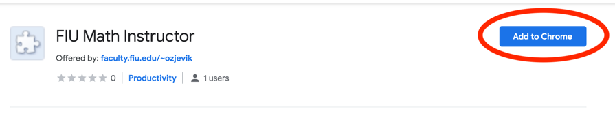

<meta name="viewport" content="width=device-width, initial-scale=1">
<meta content="Ondrej Zjevik, Florida International University" name="author" />

<head>
    <link href="https://fonts.googleapis.com/css?family=Bitter:400,400i,700%7CRoboto:300,400,500,700" rel="stylesheet">
    
    
    <link href="https://digicdn.fiu.edu/v1/_assets/stylesheets/css/foundation.min.css" rel="stylesheet">
    <link href="https://digicdn.fiu.edu/v1/_assets/stylesheets/css/font-awesome.min.css" rel="stylesheet">
    <link href="https://www.fiu.edu/_assets/images/favicon.ico" rel="icon" type="image/png" />

    
    

</head>

<body>

    <header><a class="skip-main-content" href="#main-content">Skip to Main Content</a>
        

            

                
<a href="https://www.fiu.edu/">Florida International University</a>

                

                    

                        <nav aria-label="FIU Quick Links" class="top-bar global-nav" data-topbar="">
                            

                                <ul class="right">
                                    <li class="has-dropdown show-for-large-up not-click" id="portals">
                                        <a aria-label="FIU Portals" href="#" role="button">
                                            

FIU Portals</a>
                                        <ul class="dropdown">
                                            <li class="title back js-generated">
                                                <h5><a href="javascript:void(0)">Back</a></h5>
                                            </li>
                                            <li class="parent-link hide-for-medium-up">
                                                <a class="parent-link js-generated" href="#">
                                                    

FIU Portals</a>
                                            </li>
                                            <li><a href="https://my.fiu.edu" target="_blank">MyFIU</a></li>
                                            <li><a href="http://canvas.fiu.edu/" target="_blank">FIU Canvas</a></li>
                                            <li><a href="https://fiu.blackboard.com" target="_blank">FIU Blackboard</a></li>
                                            <li><a href="http://panthermail.fiu.edu/" target="_blank">Student Email</a></li>
                                            <li><a href="http://mail.fiu.edu/" target="_blank">Faculty/Staff Email</a></li>
                                        </ul>
                                    </li>
                                </ul>
                            

                        </nav>
                    

                    

                        <a aria-label="Menu Icon" href="#" id="menu" role="button">
                            

Menu</a>
                    

                

            

        

        <nav aria-label="Website Main Navigation" class="regular-nav" data-topbar="">
            

                

                    

                        

                        

                            
<a href="http://faculty.fiu.edu/~ozjevik/" target="_top">Ondrej Zjevik's webpage</a>

                        

                    

                

            

            

                <ul class="navigation-links">
                    <li class="current"><a href="/~ozjevik/">Home</a></li>
                    <li class="has-dropdown not-click"><a href="">Currently Teaching</a>

                    </li>

                    <li class="has-dropdown not-click"><a href="">Past Courses</a>

                    </li>

                    <li class="has-dropdown not-click"><a href="">Other</a>

                    </li>
                </ul>
            

        </nav>
    </header>
    <aside aria-label="Main Menu for Mobile Devices" class="overlay-container menu">
        

            

            
<a class="fa fa-close" href="#" role="button">Close</a>

        

        

        

            

                <nav aria-label="Mobile Menu" id="mobile-menu">
                    <ul>
                        <li class="current"><a href="/~ozjevik/">Home</a></li>
                        <li class="mobile-dropdown"><button aria-expanded="false">Currently Teaching</button>

                        </li>
                        <li class="mobile-dropdown"><button aria-expanded="false">Past Courses</button>

                        </li>
                        <li class="mobile-dropdown"><button aria-expanded="false">Other</button>
                            <ul class="dropdown-items" style="display: none;">
                                <li><a href="/~ozjevik/other/faq">FAQ</a></li>
                                <?php //<li><a href="/~ozjevik/other/adobe-connect">Adobe Connect Manual</a></li> ?>
                                <li><a href="/~ozjevik/other/template">Webpage Template Manual</a></li>
                                <li><a href="/~ozjevik/other/chrome-extension">Chrome extension for Canvas -> MLP grade transfer</a></li>
                            </ul>
                        </li>
                    </ul>
                </nav>
            

        

        

            

                <ul class="quicklinks mobile">
                    <li>FIU Portals</li>
                    <li><a href="https://my.fiu.edu" target="_blank">MyFIU</a></li>
                    <li><a href="http://canvas.fiu.edu/" target="_blank">FIU Canvas</a></li>
                    <li><a href="https://fiu.blackboard.com" target="_blank">FIU Blackboard</a></li>
                    <li><a href="http://panthermail.fiu.edu/" target="_blank">Student Email</a></li>
                    <li><a href="http://mail.fiu.edu/" target="_blank">Faculty/Staff Email</a></li>
                </ul>
            

        

    </aside>

    <article id="main-content" class="row">
<!-- ENTER THE CODE BELOW -->

<article>
<h2>How to use live poll (for instructors)</h2>
<ul class="accordion" data-accordion="">
    <li class="accordion-navigation"><a class="accordion-link" href="#panel-1-1" aria-expanded="false">Setting up an iMathAS Instructor Account</a>
        

          <ul>
           <li>An iMathAS instructor account is required to use live poll.  The account is always free.  If you already have an instructor account, do not setup another one, just simply log in here, as usual: <a href="https://imathas.fiu.edu/">iMathAS Instructor Login</a>   </li>
           <li>If you forgot your password or want to reset it, go here: <a href="https://imathas.fiu.edu/forms.php?action=resetpw">Password Reset</a>   </li>
           <li>If you forgot your username, then look it up here: <a href="https://imathas.fiu.edu/forms.php?action=lookupusername">Username Lookup</a>   </li>
           <li>To establish your instructor account for the first time, make a request here: <a href="https://imathas.fiu.edu/newinstructor.php">Instructor Account Request</a> It takes upto 24 hours for your request to be approved; you will recieve a confirmation email at the time its approved.  </li>
          </ul>
        

    </li>
    <li class="accordion-navigation"><a class="accordion-link" href="#panel-2-1" aria-expanded="false">Setting up your live poll course</a>
        

           Text using <b>HTML</b> marking. This is how to enter pictures:
           
        

    </li>
    <li class="accordion-navigation"><a class="accordion-link" href="#panel-3-1" aria-expanded="false">Connecting your live poll course to Canvas</a>
        

          <ul>
           <li>An iMathAS instructor account is required to use live poll.  The account is always free.  If you already have an instructor account, do not setup another account, instead just log in here: <a href="https://imathas.fiu.edu/">iMathAS Instructor Login</a>   </li>
           <li>If you forgot your password or want to reset it, go here: <a href="https://imathas.fiu.edu/forms.php?action=resetpw">Password Reset</a>   </li>
           <li>If you forgot your username, then look it up here: <a href="https://imathas.fiu.edu/forms.php?action=lookupusername">Username Lookup</a>   </li>
           <li>To establish your instructor account for the first time, make a request here: <a href="https://imathas.fiu.edu/newinstructor.php">Instructor Account Request</a> It takes upto 24 hours for your request to be approved; you will recieve a confirmation email at the time its approved.  </li>
          </ul>
           
        

    </li>
    <li class="accordion-navigation"><a class="accordion-link" href="#panel-4-1" aria-expanded="false">Setting up a live poll session before class</a>
        

           Text using <b>HTML</b> marking. This is how to enter pictures:
           
        

    </li>
    <li class="accordion-navigation"><a class="accordion-link" href="#panel-5-1" aria-expanded="false">Running a live poll session during class</a>
        

  1)	Log into Canvas  

  2)	Click on "Modules" on the left-hand side.  

  3)	Open up "Help with Canvas & Student Resources" and click on "Live Poll".  

  This will take you directly to iMathAS.  

  4)	Your first time using the live poll during the course you will see the following screen:  

  Choose your course from the dropdown menu and click "Link Course". You will not need to do this again during the semester.  

  If you find that your course is linked to the wrong course in iMathAS, click on ‘Change Course Link’.  This will allow you to choose the correct course.  

  5)	Choose the assessment that you want and click "Make Placement".  

  6)	Announce to your students that they should now log into Canvas and access the Live Poll.  If they do so before you click "Make Placement", then they will need to click on the live poll link again in Canvas.  

  7)	Assuming that the assessment is ready to go, click on "Preview Assessment".  

  This will take you directly to the question in iMathAS.  

  8)	The assessments have three default settings:  
  a.	Show question on this computer before it is available to students – this allows you to see the question and verify it for yourself before the students see it.  
  b.	Show results on your computer after closing the assessment – this shows you the breakdown of student results after the assessment is finished.  
  c.	Show answers automatically after closing the assessment – this shows the students whether or not their answer is correct as well as the correct answer on their screens. 

  9)	If you wish the question to have a time limit, you will need to check "Use per-question time limit" and set the time you wish. If selected, students will see the time running out on their screens during the assessment.  Note: the default is to not have a time limit for the question.  

  10)	If you wish to see the student results as the students select their options while the assessment is still open, check "Show results on this computer as students submit answers".  

  11)	Select the question that you want from the left-hand side under "Questions". This will open up the question for you. You can do the questions in any order you like.  

  12)	To start the assessment and have it shown to students, click on "Start Assessment".  This will send the assessment to all of the students’ screens. You will be able to see the time running on the upper right-hand side.  Note: if you have students that cannot see the question, have them refresh the page or click on the live poll link again in Canvas.  

  13)	To close the quiz, click on "Stop Assessment".  

  14)	To do another question from the assessment, click on the new question to load it and then repeat the "Start Assessment"—->"Stop Assessment" cycle, just as in the earlier question.  

  15)	When finished asking all the questions you want to from this assessment, you have two options:  
  •	If you are done using live poll for the class meeting, then simply navigate away within Canvas as you like.  
  •	If, however, you have another live poll assessment to conduct, then click "Modules" followed by "Live Poll" and then on the next screen select the assessment you wish to conduct next, using the drop-down menu and then place it.  Repeat steps 7 through 14 above.  

        

    </li>
    <li class="accordion-navigation"><a class="accordion-link" href="#panel-6-1" aria-expanded="false">Adjusting a live poll session after class</a>
      

         Text using <b>HTML</b> marking. This is how to enter pictures:
         
      

    </li>
</ul>
</article>

<article>
<h2>How to use live poll (for students)</h2>
<ul class="accordion" data-accordion="">
    <li class="accordion-navigation"><a class="accordion-link" href="#panel-1-1" aria-expanded="false">Setting up an iMathAS Account</a>
        

           Text using <b>HTML</b> marking. This is how to enter pictures:
           
        

    </li>
    <li class="accordion-navigation"><a class="accordion-link" href="#panel-2-1" aria-expanded="false">Setting up your live poll course</a>
        

           Text using <b>HTML</b> marking. This is how to enter pictures:
           
        

    </li>
    <li class="accordion-navigation"><a class="accordion-link" href="#panel-3-1" aria-expanded="false">Connecting your live poll course to Canvas</a>
        

           Text using <b>HTML</b> marking. This is how to enter pictures:
           
        

    </li>
    <li class="accordion-navigation"><a class="accordion-link" href="#panel-4-1" aria-expanded="false">Setting up a live poll session before class</a>
        

           Text using <b>HTML</b> marking. This is how to enter pictures:
           
        

    </li>
    <li class="accordion-navigation"><a class="accordion-link" href="#panel-5-1" aria-expanded="false">Running a live poll session during class</a>
        

           Text using <b>HTML</b> marking. This is how to enter pictures:
           
        

    </li>
    <li class="accordion-navigation"><a class="accordion-link" href="#panel-6-1" aria-expanded="false">Adjusting a live poll session after class</a>
      

         Text using <b>HTML</b> marking. This is how to enter pictures:
         
      

    </li>
</ul>
</article>

<!-- ENTER THE CODE ABOVE-->
    </article>

    <!-- Sitemap Generator -->
    
    </body>
